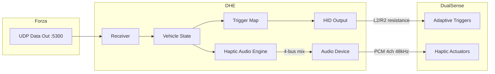

# forza-dualsense-haptics (DHE)

Forza Horizon 텔레메트리 기반 DualSense 햅틱 엔진
Telemetry-driven DualSense haptic engine for Forza Horizon

```
UDP telemetry → vehicle state → haptic decision → DualSense HID output
```

---

## 기능 / Features

- **적응형 트리거 / Adaptive Triggers** — 페달 저항, ABS 진동, 기어 킥, 레브 리미터 / Pedal resistance, ABS vibration, gear kick, rev limiter
- **햅틱 오디오 엔진 / Haptic Audio** — 4-bus 음향 믹서 (노면·차체·엔진·이벤트) / 4-bus audio mixer (surface·vehicle·engine·event)
- **실시간 GUI / Real-time GUI** — 라이브 계기판, 슬라이더 튜닝, 프리셋 관리 / Live dashboard, slider tuning, preset management
- **HID 직접 통신 / Direct HID** — 외부 드라이버 불필요, USB/BT 자동 감지 + 재연결 / No external driver, USB/BT auto-detect + reconnect

---

## 요구사항 / Requirements

- Windows 10/11 (x64)
- Python 3.13 x64 권장 / recommended (3.13+ for source)
- DualSense 컨트롤러 / controller (USB or BT)
- Forza Horizon 4/5/6 — Data Out 활성화 / enabled (UDP)

---

## 빠른 시작 / Quick Start (릴리스 zip)

1. [Releases](../../releases)에서 최신 zip 다운로드 / Download latest zip
2. 압축 해제 → `DHE.exe` 실행 / Extract → run `DHE.exe`
3. Forza: Settings → HUD → Data Out `ON`, IP `127.0.0.1`, Port `5300`
4. 주행 시작 — 트리거 피드백 즉시 활성화 / Start driving — feedback activates immediately

---

## 소스 실행 / Run from Source

```bash
setup_vendor.bat   # 의존성 설치 / install dependencies
run_dhe.bat        # 실행 / run
```

---

## 빌드 / Build (PyInstaller)

```bash
pip install pyinstaller
build.bat          # → dist/DHE/DHE.exe
release.bat        # → DHE_v1.02.zip
```

---

## 프로젝트 구조 / Architecture



---

## Forza Data Out 설정 / Setup

| 항목 / Setting | 값 / Value |
|----------------|------------|
| Data Out | ON |
| IP Address | 127.0.0.1 |
| Port | 5300 |
| 컨트롤러 진동 / Controller vibration | OFF (중복 방지 / avoid duplicate) |

Forza: **Settings → HUD → Data Out**
포트는 앱 내에서 변경 가능합니다 / Port is configurable in the app

---

## 문제 해결 / Troubleshooting

### 텔레메트리 수신 안 될 때 / No telemetry received

1. Forza에서 Data Out **ON** 확인 / Confirm Data Out is ON
2. IP `127.0.0.1`, Port `5300` 확인 / Verify IP and Port
3. Windows 방화벽 확인 / Check firewall is not blocking UDP 5300
4. `127.0.0.1` 대신 PC의 실제 IPv4 주소 시도 / Try your PC's actual IPv4 address
5. **Game Pass / Microsoft Store** — UDP 루프백 예외 필요할 수 있음 / May need loopback exemption:
   Run as admin PowerShell:
   ```
   CheckNetIsolation LoopbackExempt -a -n="Microsoft.SunriseBaseGame_8wekyb3d8bbwe"
   ```
6. 다른 앱이 포트 5300을 사용 중인지 확인 / Check no other app is using port 5300

### DualSense 감지 안 될 때 / DualSense not detected

- USB 케이블 또는 BT 연결 확인 / Check USB or Bluetooth connection
- HidHide 등 클로킹 도구 확인 / Check if cloaking tools are hiding the device
- 컨트롤러 재연결 시도 / Try reconnecting the controller

### Steam에서 DualSense 설정 / Steam DualSense Configuration

Steam 버전 Forza는 **Steam Input이 켜져 있어야** DualSense를 컨트롤러로 인식합니다.
Steam version of Forza requires **Steam Input enabled** to recognize DualSense as a controller.

1. Steam → 설정 → 컨트롤러 → "PlayStation 컨트롤러 지원" **체크**
   Steam → Settings → Controller → **Check** "PlayStation Controller Support"
2. Forza 속성 → 컨트롤러 → Steam Input 활성화: **기본값 사용** 또는 **강제 켜기**
   Forza Properties → Controller → Steam Input: **Use default** or **Force on**

### Game Pass / MS Store에서 컨트롤러 인식 문제 / Controller not recognized in Game Pass

Game Pass판 Forza에서 DualSense가 컨트롤러로 인식되지 않으면 XInput 매퍼를 사용하세요.
If Game Pass Forza doesn't recognize your DualSense, use an XInput mapper.

- DSX, DS4Windows, DualSenseY 등을 사용하면 DualSense를 Xbox 컨트롤러로 인식시킬 수 있습니다.
  Use tools like DSX, DS4Windows, or DualSenseY to map DualSense as an Xbox controller.

### 햅틱 오디오 설정 / Haptic Audio Setup

DualSense 햅틱은 컨트롤러가 **Windows 오디오 출력 장치**로 인식되어야 작동합니다.
DualSense haptics require the controller to appear as a **Windows audio output device**.

1. DualSense를 **USB**로 연결 (BT에서도 되지만 USB가 안정적) / Connect via **USB** (BT works but USB is more stable)
2. Windows: 설정 → 시스템 → 소리 → 출력 장치 목록에서 "Wireless Controller" 또는 "DualSense" 확인
   Windows: Settings → System → Sound → verify "Wireless Controller" or "DualSense" appears in output devices
3. **기본 출력 장치를 바꾸지 마세요** — DHE가 자동으로 DualSense를 찾아 전용 출력합니다
   **Do NOT change your default output** — DHE auto-detects DualSense and outputs exclusively to it
4. 장치가 안 보이면: 장치 관리자에서 "사운드, 비디오 및 게임 컨트롤러" 확인 / If not visible: check Device Manager → Sound controllers

---

## 진단 도구 / Diagnostics

두 가지 진단 기능을 제공합니다. 배치 파일 또는 명령줄 중 편한 방법을 사용하세요.
Two diagnostic tools are available. Use whichever method you prefer.

### 자가 진단 / Self-Test

컨트롤러 연결, HID 통신, 트리거 저항, UDP 포트를 순서대로 점검합니다.
Tests controller connection, HID communication, trigger resistance, and UDP port.

| 방법 / Method | 실행 / Run |
|---------------|-----------|
| 배치 파일 / Batch file | `DHE_SelfTest.bat` 더블클릭 / double-click |
| 명령줄 / Command line | `DHE.exe --self-test` |

### 진단 내보내기 / Export Diagnostics

GitHub Issue 제출 시 첨부할 진단 번들을 생성합니다.
Creates a diagnostic bundle to attach when filing a GitHub Issue.

| 방법 / Method | 실행 / Run |
|---------------|-----------|
| 배치 파일 / Batch file | `DHE_ExportDiagnostics.bat` 더블클릭 / double-click |
| 명령줄 / Command line | `DHE.exe --export-diagnostics` |

---

## 안전성 / Safety

DHE는 게임을 수정하지 않습니다. 치트나 핵이 아닙니다.
DHE does not modify the game. It is not a cheat or hack.

- Forza가 공식 제공하는 UDP 텔레메트리만 수신 / Only reads Forza's official UDP telemetry output
- DualSense에 표준 HID 명령만 전송 / Only sends standard HID commands to the controller
- 게임 프로세스에 접근하거나 주입하지 않음 / Does not access or inject into the game process

---

## 라이선스 / License

[Apache-2.0](LICENSE)
